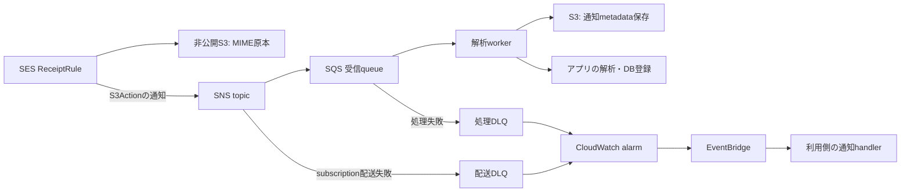

# SES 受信宣言の設計案（KN1449）

2026-09-12 時点。**設計回答であり、以下の宣言・追加コマンドは未実装です。**
KN1449 の同日07:45 UTCの要件更新（S3保存アクションのSNS通知を使う）を対象とします。
メール受信基盤の実装・公開と、利用側の本番導入は別工程です。

## 現状と責務

現行0.34.1とdevコードを確認しました。`pocket.settings.Ses` は
`from_email` / `region` / `configuration_set` の送信設定で、受信ドメイン、ReceiptRule、
受信用S3、SNS→SQS subscriptionを作る宣言はありません。
`pocket.permissions` のSES権限も `SendEmail` / `SendRawEmail` のみです。

既存のSQS worker宣言はqueue、処理失敗DLQ、EventSourceMapping、partial batch responseを
再利用できます。DLQ通知は現在emailまたは明示的無効化で、email不要のalarmのみ生成する
選択肢は追加が必要です。今回同期したtask / feedbackの未完一覧には、KN1449以外に
SES受信の実装課題はありません（完了済み全履歴までは探索していません）。

| 担当 | 範囲 |
|---|---|
| pocket | 受信宣言、AWSリソース、IAM、通知形式の検証・保存ヘルパ、状態表示、再処理の手順 |
| アカウント管理者 | 有効rule setの作成・初回有効化、共有ルール順序・宛先割当の管理 |
| DNS管理者 | 別accountを含む所有権確認・MXレコードの設定 |
| アプリ | MIME解析、業務上の重複防止、DSQL等への登録、Web UI、返信案、Pushover通知 |

## 推奨経路



S3Actionの通知は原本のbucket/keyと `mail` / `receipt` を含み、MIME本文は含みません。
独立したSNSActionは使いません。仕様の根拠は
[受信通知の内容](https://docs.aws.amazon.com/ses/latest/dg/receiving-email-notifications-contents.html)と
[S3保存アクション](https://docs.aws.amazon.com/ses/latest/dg/receiving-email-action-s3.html)です。
S3 Object Created通知、EventBridge、橋渡し専用Lambdaは受信経路に追加しません。

## 宣言案（未実装）

送信専用の `[ses]` を必須にしない独立節 `[mail_receiving.<name>]` を追加する案です。
SNS topicやsubscriptionは内部リソースとして生成し、利用者は受信先とworkerを指定します。
設定名は実装時に確定します。

```toml
[mail_receiving.inbox]
domain = "inbox.example.com"
recipients = ["capture@inbox.example.com"]
handler = "mail.worker"
enabled = true
tls_policy = "Require"
scan_enabled = true
raw_prefix = "raw/"
metadata_prefix = "metadata/"
import_prefix = "imports/"
retention_days = 365                # 原本とmetadataを同期間保持する例
delivery_alert = { email = "ops@example.com" }

[container.mail]
dockerfile_path = "mail/Dockerfile"

[container.mail.handlers.worker]
command = "mail-worker"
timeout = 120
sqs = { dead_letter_alert = { email = "ops@example.com" } }

[dev.mail_receiving.inbox]
domain = "inbox-dev.example.com"
recipients = ["capture@inbox-dev.example.com"]
```

通知の標準例は既存DLQと同じ `email` 指定とします。配送DLQと処理DLQは別alarmですが、
同じemail宛先を指定できます。SNS email購読の初回確認が必要です。
`eventbridge = true` は外部通知経路を利用する場合の、未実装のAlert拡張案です。email / eventbridge / enabled=falseを
排他的に検証し、eventbridgeではalarmを作成してARNを出力します。監視の無設定を
許可しない既存方針は維持します。上の保持日数は例で、全stageで明示指定を必須にします。
stage名には意味を持たせず、受信先・保持期間・有効化はすべて通常のstage上書きで選びます。

初版の制約は以下です。

- 受信リソースとworkerはstageの同一account・regionに配置。SES受信対応regionのみ許可。
  AWS上はS3の例外がありますが、初版は同一regionに制限します。
  [SESのリージョン制約](https://docs.aws.amazon.com/ses/latest/dg/regions.html)
- 受信専用bucketを生成し、既存の公開サイト用 `[s3]` bucketと分離。Block Public Access、
  versioning、SSE-S3、HTTPS必須、原本・metadataに同じ保持規則を設定します。
  `raw/` と `metadata/` のworker削除権限は与えません。SES独自のクライアント側暗号化は
  使用しません。暗号化方式を後で追加する場合は別仕様とします。
- workerには既存のSQS設定を必須とし、SNS属性フィルターを設けません。
  初版は1受信宣言に1専用worker queueを割り当てます。
- 受信ドメイン全体のcatch-allや宛先未指定は初版では不可。明示したメールアドレスだけを
  対象とし、raw / metadata / imports / attachmentsのprefix重複も拒否します。
- `scan_enabled=true` は判定情報を付ける設定です。隔離・解析可否はアプリが決めます。
  不合格メールも原本・通知情報を保存し、通常の解析処理と区別します。

## handlerの参照形式

`handler = "mail.worker"` は既存のCloudFront routes / schedulerと同じ
`<container名>.<handler名>` の形式に揃えます。`pocket.settings.parse_handler_ref` が
既存機能の共通パーサーです。新機能だけ `container = "mail"` と `handler = "worker"` の
2項目に分けると、同じhandler参照に異なる記法が増えるため、この案では採用しません。

- CloudFront: `handler = "main.wsgi"` は `container.main.handlers.wsgi` を参照。
- scheduler: `handler = "main.worker"` は `container.main.handlers.worker` を参照。
- メール受信: `handler = "mail.worker"` は `container.mail.handlers.worker` を参照。

参照側は処理の接続先を選び、`container.<name>.handlers.<key>` 側はcommand・timeout・
SQS等を定義します。メール専用containerは必須ではなく、既存containerのworkerを使うなら
`handler = "main.worker"` と指定できます。専用containerの例はメール原本のアクセス権を
他handlerから分離したい場合の選択であり、参照形式が2要素なのはそのためではありません。

既存設定の例は[複数containerとroutes](../guide/configuration.md#container)および
[設定ガイドのscheduler](../guide/configuration.md#scheduler)を参照してください。

## 受信メタデータと再処理契約

SNS subscriptionは `RawMessageDelivery=false` に固定し、SQS bodyのSNS envelopeと
その `Message` 内のSES通知を保存ヘルパが解釈します。未知のフィールドも破棄せず、
取得した通知全体と形式versionをS3へ保存します。

1. 期待したTopicArn、`notificationType=Received`、`receipt.action.type=S3`、
   宣言済みbucket/prefixを検証。本文のbucket/keyをそのまま任意S3へのアクセスに使いません。
2. `mail.messageId` と受信宣言IDから安定したreceipt IDを作成し、
   `metadata/<receipt-id>.json` に条件付き作成。`receipt.recipients`（当該ruleに一致した
   envelope宛先）と `mail.destination` を両方保存し、To/Ccヘッダから補完しません。
   spam / virus / SPF / DKIM / DMARC判定、各timestamp、元SNS通知も保持します。
3. 原本は通知の `bucketName` / `objectKey` で取得し、取得したS3 VersionId・ハッシュを
   metadataへ関連づけます。解析・業務DB更新より前に原本参照とmetadata保存を完了します。
4. metadata作成後に同じ通知が再送されても消したり上書きしたりせず、既存の内容と照合。
   食い違いは隔離してエラー扱いとし、解析成功を示すDB側のreceipt IDで業務更新を冪等にします。
5. 部分失敗は失敗したSQS recordのみ返却。metadata保存に失敗した場合も成功扱いにしません。
   schema / parser versionを保存し、再処理はreceipt ID + 処理versionで管理します。

S3に原本があるだけでは通知がすべて復元できるとは扱いません。原本を先に保存しても、
SES→SNSの通知失敗や、workerがmetadataを永続化する前の長期停止で欠落し得ます。
SQS/DLQ保持期限内に通知を救出する運用が必要です。定期照合は `raw/` に対応するmetadataの
ない原本を検出し、`metadata_missing` として表示します。原本ヘッダから推測した値を
SESの受信情報として生成しません。この経路だけで通知情報の無期限・無損失を保証しません。

devへの選択コピーは、承認された原本VersionIdとmetadataをまとめたmanifestで行います。
コピー後はdev側bucket/keyを別フィールドに保持し、元のreceipt・原本識別子を残します。
`imports/` への配置だけでは解析を開始せず、明示的な取り込みジョブが同じ解析関数を呼びます。
原本だけのテストデータは `source=import, metadata_status=missing` として扱います。
attachmentsの保存でも受信イベントは発生しないため、再帰処理を起こしません。

## rule set共存とDNS

通常のTOMLには **`rule_set` も `after_rule` も書きません**。次の解決をdeploy側で行います。

1. 初回deployで `DescribeActiveReceiptRuleSet` を呼び、有効なセットを選択します。
   自projectのruleのみを追加し、既存セットや既存ruleの所有権は取得しません。
2. 作成時は既存ruleの末尾を取得して `After` へ渡します。空のセットなら `After` を省略。
   複数の新規ruleは安定したslot順で順次追加します。既存anchorの準備は不要です。
3. 解決したセット名と自所有rule名を受信stackのparameter/outputに記録します。
   次のdeployで有効セットが変わっていても別セットへ自動移設せず、差異を示して中断します。
   省略は初回の自動解決であり、毎回任意のセットへ追随する意味ではありません。
4. 更新時は既存ruleの位置を維持します。`After` を毎回現在の末尾で再計算して
   自ruleや他projectのruleを参照する並べ替え・循環を起こさないことを実装条件とします。
   AWS上から自所有ruleが消えている場合も、勝手な再作成より先にdriftとして報告します。

有効なセットがまだない場合は、account / regionで一度だけ初期設定が必要です。
名前を選ばせず、共有の固定名 `pocket-inbound` を作成・有効化するセットアップを用意する案です。
通常deployはこのアカウント全体の操作を暗黙に行わず、未初期化時に実行方法を案内します。
セットアップのコマンド名は未確定で、現時点では実行できません。

セットアップは既存の有効セットがあれば変更せず再利用します。有効セットがなくても同名の
未管理セットがあれば所有権を自動取得せず、内容・管理者の確認を求めます。
作成・有効化の直前と直後に有効セットを再確認し、他のセットが有効になっていた場合は
上書きしません。SESには条件付き有効化のAPIがないため、同時の初期設定は管理者側で
直列化する必要があります。作成した共有セットはprojectのdestroyでは削除・無効化しません。

管理者が設定を明示固定したい場合のみ、任意の `rule_set` を指定できる余地を残します。
その場合も有効セットと一致することを検証します。`after_rule` は公開設定に設けず、
既存の順序に例外的な調整が必要なら共有セットの管理者が対応します。

末尾に置くだけで既存ルールとの共存を保証できるわけではありません。
deploy前に宛先重複・ドメインcatch-all・Stop/Bounce等の先行アクションを検査し、
処理競合や到達できない可能性があれば該当rule名を示して中断します。複数宛先を含む
同一メールへの影響もあるため、宛先が違うだけで安全とは判定しません。
共有管理者の宛先割当と排他的な変更時間帯を前提とし、直前・直後にも再確認します。
AWSにatomicな宛先予約はないため、同時deployの完全排他を検査だけで保証しません。
ReceiptRule名はstage / project / slotを含む安定名とし、StopActionは自動追加しません。

AWSは有効セットとそのrule一覧を取得できます。一方で `After` を単に省略すると
先頭に追加されるため、「TOMLから省略」と「AWS APIに値を渡さない」は区別します。
根拠は [有効セット取得](https://docs.aws.amazon.com/ses/latest/APIReference/API_DescribeActiveReceiptRuleSet.html)、
[ルール追加位置](https://docs.aws.amazon.com/ses/latest/APIReference/API_CreateReceiptRule.html)、
[有効化API](https://docs.aws.amazon.com/ses/latest/APIReference/API_SetActiveReceiptRuleSet.html)です。

ドメイン所有権確認・MXレコードは、受信stage accountでidentityを作成して必要レコードを
出力し、DNS所有accountの管理者に渡します。通常deployはDNSを直接変更しません。
dev / prodで別の受信サブドメインを使い、同じドメインの複数account同時受信を避けます。
[SESの受信準備](https://docs.aws.amazon.com/ses/latest/dg/receiving-email-setting-up.html)

## IAMとPermissionsBoundary

| 主体 | 許可の範囲 |
|---|---|
| SES | 専用bucketのraw prefixへのPutObjectと受信topicへのPublishのみ |
| SNS | 当該topicから受信queue / 配送DLQへのSendMessageのみ |
| worker | 当該queueのReceive/Delete/GetAttributes、原本のGetObject/GetObjectVersion、metadataのGet/Putのみ |
| 取り込みジョブ | 選択manifestの原本・metadata読取と、dev側imports/への書込・処理要求のみ |
| 通知handler | alarmイベントの受信、通知secretの取得、通知先への送信。メール原本アクセスなし |

SESのbucket/topic policyはservice principalに対してSourceAccountと当該receipt-rule ARNで
制限します。SNSのqueue policyもSourceArnを当該topicへ絞ります。
[SES受信の権限設定](https://docs.aws.amazon.com/ses/latest/dg/receiving-email-permissions.html)
を根拠にテンプレートを生成します。

初版はSES用の新規IAM roleを作らずresource policyを使用します。
worker / 通知handler等のroleを作る場合は既存のpermissions_boundary設定を必須にし、
forge環境では `FORGE_PERMISSIONS_BOUNDARY_ARN` を使用します。
現状のpocketはcontainer単位で実行roleを共有するため、メールアクセスを他handlerから
分離するには上の例のように専用containerを使います。

deploy roleにはSES identity / ReceiptRuleの作成・照会・更新・削除、既存rule set照会、
S3/SNS/SQS/CloudWatchの構築権限を追加します。`SetActiveReceiptRuleSet`は通常deployの
要求権限に含めません。APIがresource制約をサポートするものは所有resourceのみに絞り、
一覧APIは必要なものだけに限定します。`pocket permissions` の機械可読出力と
`docs/permissions/aws.md` を同時更新し、baselineへの反映後に利用側を更新します。
Pushoverのsecretは利用側のSSM SecureStringで管理します。

## 失敗・通知・復旧

| 区間 | 検出・保持 | 復旧 |
|---|---|---|
| SES→S3 / SNS | SES ruleのPublishFailure / PublishExpired alarm、原本とmetadataの照合 | 権限・rule修正、未処理原本を確認。通知が無いものは欠落を明示 |
| SNS→SQS | subscriptionのRedrivePolicyに専用配送DLQ、保持14日、滞留alarm | queue policy等を修正し、保管された通知を同じ受信queueへ再投入 |
| SQS→worker | 既存処理DLQ、maxReceiveCount 5、DLQ保持14日、partial batch response | 原因修正後に元queueへredrive、receipt IDで重複抑止 |
| metadata保存・DB登録 | SQS retry、原本は消さず保持。保存後の解析失敗も追跡 | metadata + 原本VersionIdを使って処理versionを指定して再処理 |
| alarm→通知handler | 利用側EventBridge targetのretry / DLQ、通知失敗の独立監視 | 通知経路の復旧と再送 |

SNS配送DLQはsubscriptionに設定し、同account / regionに置きます。SNSが受け付ける前の
SES通知失敗は捕捉しません。再投入ツールは保存された形式を識別し、受信queueが期待する
SNS envelope + SES Messageへ正規化してから送ります。形式不明のメッセージは隔離します。
[SNS DLQ](https://docs.aws.amazon.com/sns/latest/dg/sns-dead-letter-queues.html)、
[SES受信メトリクス](https://docs.aws.amazon.com/ses/latest/dg/receiving-email-metrics.html)

受信queueも保持14日に設定し、queueの最古メッセージ経過時間を監視します。長期障害時は
保持期限より前に配送・処理DLQの通知をmetadata保管領域へ退避します。retention_daysは
queue保持期間以上に制約し、保管済み原本とmetadataに独立した短い有効期限を設けません。

人への通知は受信topicとは独立です。`eventbridge=true`ではemail購読を作らず、
CloudWatch alarmのARN一覧と、ALARM / OKを選別するEventBridge pattern例を出力します。
利用側はそのARNを指定したruleと通知handler、target retry / DLQを管理します。
CloudWatchは状態変更をEventBridgeへ送信するため、alarmのSNS email actionは不要です。
[alarmとEventBridge](https://docs.aws.amazon.com/AmazonCloudWatch/latest/monitoring/cloudwatch-and-eventbridge.html)
通知先への到達までpocketが検証できるわけではないので、statusでは
「alarm作成済み・外部通知接続は未検証」を区別します。

## 通常deploy / promoteへの統合案

bucket / topic / delivery DLQ / ReceiptRuleは受信専用stack、worker queueと処理DLQは既存の
container stackへ置きます。相互ImportValueの循環を作らないよう、topic / queue ARNと
bucket名はaccount / region / slug / slotから計算する安定名を使います。

1. 設定検証・identity / 有効rule setの自動解決と保存済み参照の照合 / 宛先競合の事前検査。
2. bucket / topic / 配送DLQ等を作成。初回ReceiptRuleは無効のまま。
3. 既存container stackでworker / queue / metadata権限を構築。
4. SNS subscription、両queue policy、alarmを構築して状態確認。
5. ReceiptRuleのS3ActionにBucketName / ObjectKeyPrefix / TopicArnを設定し、指定の
   enabled状態へ更新。bucket/topic policyを先に作る依存関係を明示。
6. deploy末尾とstatusでidentity、rule setの有効性、受信rule、subscription、DLQ、
   alarm、DNSの必要レコードを表示。

`pocket build` → `pocket promote` でも同じresource構築経路を通します。promote専用の
SES手動設定は作りません。更新でbucket/prefix/handlerが変わるときは、既存ruleを一旦無効化し、
新経路を完成してから再有効化します。経路変更中の受信停止時間を表示し、旧queueを空にしてから
後片付けします。通常のimageのみの昇格では受信経路を止めません。

撤去はrule無効化→queue処理完了/通知退避→自所有rule/subscription等の撤去の順です。
共有rule set、identity、原本・metadata bucketは保持します。bucketにはDeletionPolicyと
UpdateReplacePolicyのRetainを設定し、通常destroyからデータを消しません。
新しいresource型にも宣言を外す前の撤去手順と残存警告を実装します。

## 導入・検証手順（実装後に実行）

現時点で上のTOMLを既存pocketへ投入しても動きません。先行導入が必要な場合は利用側が
上記AWSリソースを外部IaCで管理し、将来pocketへ移す際は既存resourceを無断adoptしません。

1. 設定・テンプレート・通知保存ヘルパを実装し、新機能としてminorリリース。
   公開APIをCLIが新たに参照する場合はCLIのruntime下限もその版へ更新。
   deploy roleに要求権限を反映し、同じ版を使う検証用の受信containerを用意。
2. 管理者が検証accountに受信domain identityを用意。rule setは既存有効セットを
   自動選択し、なければ名前入力不要の初回セットアップで共有セットを用意。
   出力した所有権確認・MXレコードをDNS側で設定し、dev専用宛先を用意。
3. 通常のbuild / promoteを実行し、rule有効化までの順序、SNS→SQS配信、alarm ARN出力を確認。
   別projectの既存ruleの順序・宛先・有効性が変わらないことも確認。
   有効セットあり/なし/空、同名未管理セット、再deploy時の有効セット変更、
   自rule削除、Stop/Bounce競合、同時初期設定を検証。省略設定での順序安定性も確認。
4. Gmailの転送先確認メールを受信し、原本・metadata・解析結果を確認して確認リンクを操作。
   選択したフィルターだけを転送し、実メール、添付あり、非ASCII、日本語件名、複数宛先を検証。
   notificationにMIME本文が無く、envelope宛先とヘッダ宛先を区別できることを確認。
5. 同じ通知の複数回投入、workerの部分失敗、metadata保存拒否、DB更新失敗を注入。
   二重登録がなく、原本を消さず、失敗recordだけが再試行/DLQへ移ることを確認。
6. 隔離した検証queueのpolicyを一時変更してSNS配送失敗を起こし、配送DLQと処理DLQが
   混同されないことを確認。SESのPublishFailure監視も別に確認。全変更を復元しredrive。
7. ALARM→EventBridge→通知handler→Pushoverの実着信と、OK復旧通知を確認。
   通知handler自体の失敗もtarget DLQで確認。SNS email購読が無いことを確認。
8. 原本+metadataの選択コピー、明示importジョブ、metadataなし試料、attachments出力を検証。
   prod原本を試験時に無断コピーせず、最初は合成メールを使用。
9. dev / prod双方のTOMLから生成テンプレートを比較し、stage名分岐なしでaccount/domainが
   分離されることを確認。本番は利用側の最終判断後、同じbuild済みimageをpromote。
10. rule無効化・再有効化・destroyを検証し、共有rule setと原本/metadataが保持されることを確認。

今回の完了範囲は現状確認と、この設計・導入手順の提示です。受信機能の実装、実メール検証、
本番適用を実施済みとは扱いません。実装着手時はこの順序を検証可能なタスクへ分割します。
