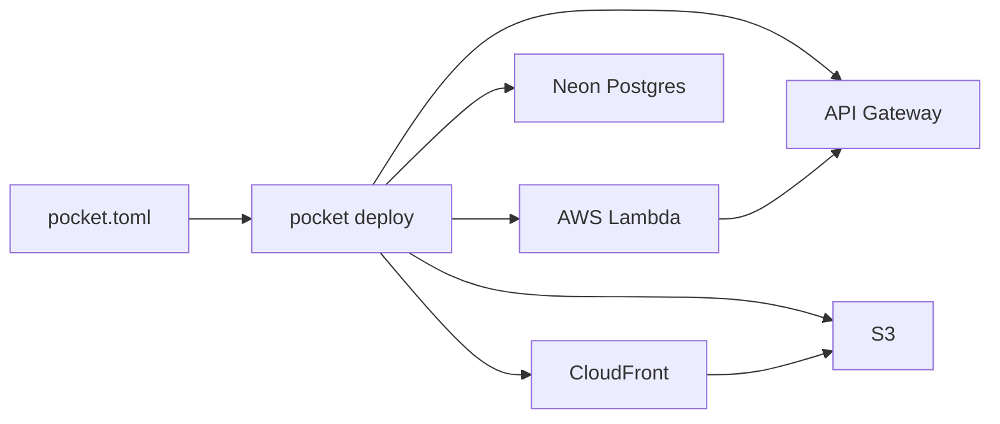

# Magic Pocket

**magic-pocket** は、DjangoプロジェクトをAWS Lambda + Neon Postgres + S3 にデプロイするためのCLIツールです。

設定ファイル `pocket.toml` を書くだけで、コマンド1つでインフラ構築からデプロイまで完了します。

## 特徴

- **サーバー保守不要** — AWS Lambdaを利用したサーバーレス構成
- **使わない間のコストが最小** — リクエストがなければ課金なし（一部固定費あり）
- **コマンド1つでデプロイ** — `pocket deploy --stage=dev` だけ
- **マルチステージ対応** — dev / prd などの環境を `pocket.toml` で一元管理
- **シークレット自動生成** — SECRET_KEY、DB接続情報などを自動でSecrets Managerに保存

## アーキテクチャ



## クイックスタート

```bash
# インストール
pip install magic-pocket

# Djangoプロジェクトで初期設定を生成
pocket django init

# デプロイ
pocket deploy --stage=dev

# マイグレーション & 静的ファイル
pocket django manage migrate --stage=dev
pocket django manage collectstatic --noinput --stage=dev
```

詳しくは「[はじめに](getting-started.md)」を参照してください。

## 固定費について

!!! warning "無視できない固定費"
    以下のリソースには固定費が発生します。

    **NAT Gateway**
    :   EFS（cache）やNeonへのIP制限接続で必要になります。
        dev環境を多数作る場合は、プロジェクト内で共有する設定が可能です。

    **Secrets Manager**
    :   個数に対する従量課金です。同プロジェクト内で共有する設定が可能です。

    **Neon**
    :   月額サブスク料金。1アカウントで複数プロジェクト利用可能なので、RDSと比較すれば十分安価です。
