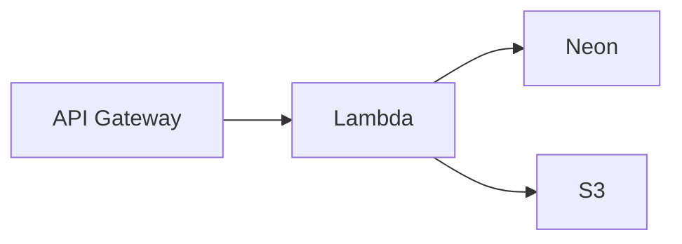
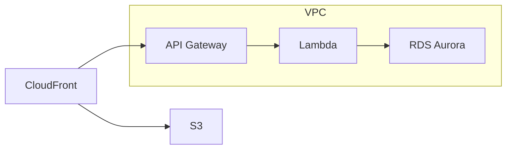

# Magic Pocket

**magic-pocket** は、Django / Rust (Loco) プロジェクトを AWS Lambda + データベース (Neon / TiDB / RDS Aurora) + S3 にデプロイするためのCLIツールです。

設定ファイル `pocket.toml` を書くだけで、コマンド1つでインフラ構築からデプロイまで完了します。

## 特徴

- **コマンド1つでデプロイ** — `pocket deploy --stage=dev` だけ
- **マルチステージ対応** — dev / prd などの環境を `pocket.toml` で一元管理
- **シークレット自動生成** — SECRET_KEY、DB接続情報などを自動でSecrets Managerに保存
- **固定費なしのdev環境** — VPC / RDS を使わない構成なら、リクエストがない間の固定費はゼロ

## 構成例

1つの `pocket.toml` から、ステージごとに異なる構成をデプロイできます。

```toml
[general]
region = "ap-northeast-1"
stages = ["dev", "prd"]

[s3]

[awscontainer]
dockerfile_path = "pocket.Dockerfile"

[awscontainer.handlers.wsgi]
command = "pocket.django.lambda_handlers.wsgi_handler"

[awscontainer.secrets.managed]
SECRET_KEY = { type = "password", options = { length = 50 } }

# --- dev: Neon、VPCなし ---

[dev.neon]
project_name = "dev-myproject"

[dev.awscontainer.secrets.managed]
DATABASE_URL = { type = "neon_database_url" }

[dev.awscontainer.handlers.wsgi]
apigateway = {}

# --- prd: RDS + VPC + CloudFront ---

[prd.vpc]
ref = "main"
zone_suffixes = ["a", "c"]

[prd.rds]

[prd.awscontainer.handlers.wsgi]
apigateway = {}

[prd.cloudfront.web]
domain = "example.com"
routes = [
    { is_default = true, is_spa = true },
    { path_pattern = "/api/*", type = "api", handler = "wsgi" },
]
```

**`pocket deploy --stage=dev`**


```mermaid
graph LR
    APIGW[API Gateway] --> Lambda
    Lambda --> Neon
    Lambda --> S3
```

**`pocket deploy --stage=prd`**


```mermaid
graph LR
    CF[CloudFront] --> S3
    CF --> APIGW[API Gateway]
    subgraph VPC
        APIGW --> Lambda
        Lambda --> RDS[RDS Aurora]
    end
```

## クイックスタート

```bash
# インストール（PyPI）
uv add magic-pocket

# または、ソースからインストール（最新の開発版）
uv add git+https://github.com/worgue/magic-pocket.git

# Djangoプロジェクトで初期設定を生成
pocket django init

# デプロイ
pocket deploy --stage=dev

# マイグレーション & 静的ファイル
pocket django manage migrate --stage=dev
pocket django manage collectstatic --noinput --stage=dev
```

詳しくは「[はじめに](getting-started.md)」を参照してください。

## 固定費について

!!! warning "無視できない固定費"
    以下のリソースには固定費が発生します。

    **NAT Gateway**
    :   EFS（cache）やNeonへのIP制限接続で必要になります。
        dev環境を多数作る場合は、プロジェクト内で共有する設定が可能です。

    **Secrets Manager**
    :   個数に対する従量課金です。同プロジェクト内で共有する設定が可能です。

    **Neon**
    :   月額サブスク料金。1アカウントで複数プロジェクト利用可能なので、RDSと比較すれば十分安価です。

    **RDS Aurora Serverless v2**
    :   `[rds]` 使用時。最小キャパシティ 0.5 ACU からスケールし、使用量に応じた従量課金です。
        Neon と比べると固定費は高くなりますが、既存 RDS 資産がある場合や高い可用性が必要な場合に適しています。
